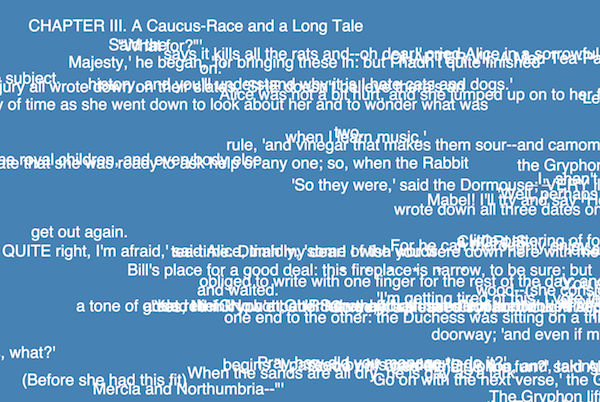

# Text Vis Starter Kit

A simple project to provide starter code for text visualization in D3.js or P5.js.

## Getting Started

There is one optional `npm` package you can use to host this site locally.

Running:

```
npm install
```

Should install the `http-server` node module locally.

Then the local server can be started using:

```
npm start
```

Which simply runs the server in this directory.

If you have your own local server solution (like python's simple http server), feel free to use that!

## D3 Example

The `d3.js` example is accessed by viewing `index.html`

It is implemented in `src/main.js`.

We use the [D3 Pack Layout](https://github.com/mbostock/d3/wiki/Pack-Layout#pack) to make an odd "text splatter" out of the words in _Alice in Wonderland_ - which is stored in `data/alice.txt`.


## P5.js Example

The `p5.js` example is accessed by viewing `index-p5.html`

It is implemented in `src/main-p5.js`.

We simply display lines from _Alice in Wonderland_ randomly on the screen.
The lines slowly move down off the screen. When a line goes away, two more take its place,
eventually turning into a snow of text (and probably will crash your browser ;) ).


